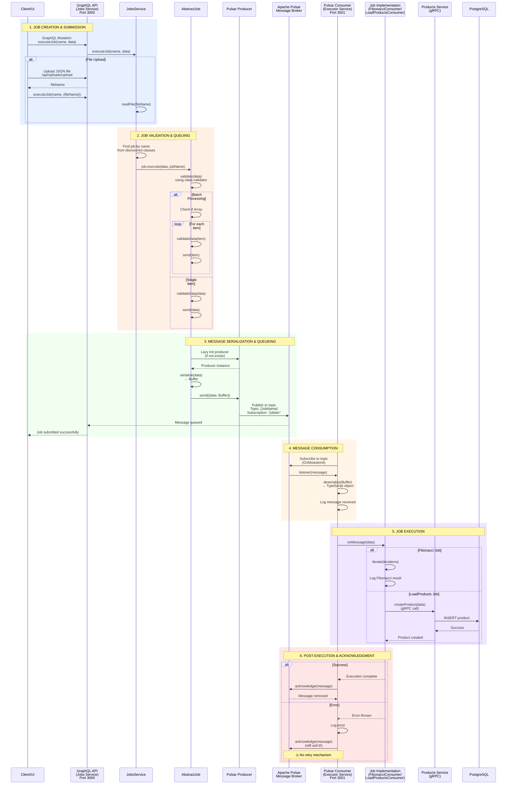
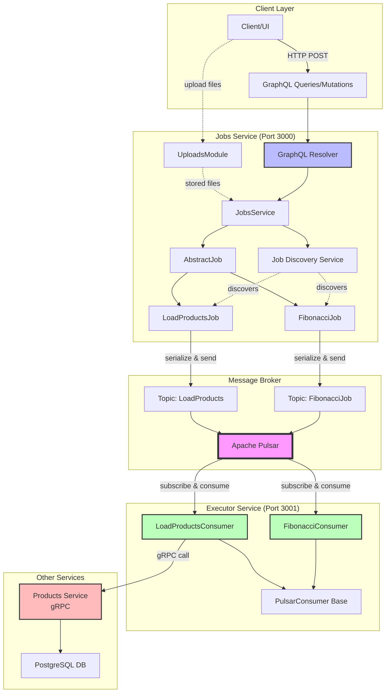
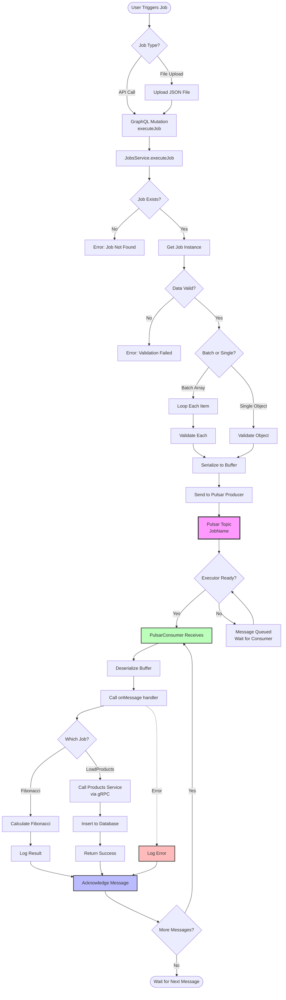
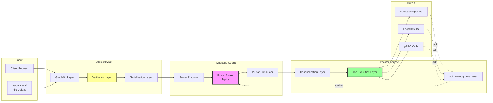
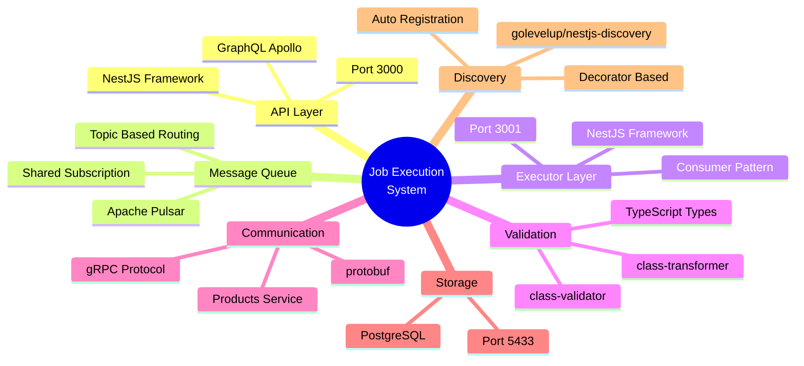

# Job Execution Flow Diagram

## Complete End-to-End Flow

## System Architecture Overview

## Component Interaction Flow

## Data Flow Architecture

## Technology Stack

## Key Files Reference

| Component             | File Path                                                       | Line |
| --------------------- | --------------------------------------------------------------- | ---- |
| GraphQL Resolver      | `apps/jobs/src/app/jobs.resolver.ts`                            | 11   |
| Jobs Service          | `apps/jobs/src/app/jobs.service.ts`                             | -    |
| Abstract Job          | `apps/jobs/src/app/jobs/abstract.job.ts`                        | -    |
| Fibonacci Job         | `apps/jobs/src/app/jobs/fibonacci/fibonacci.job.ts`             | -    |
| LoadProducts Job      | `apps/jobs/src/app/jobs/products/load-products.job.ts`          | -    |
| Pulsar Client         | `libs/pulsar/src/lib/pulsar.client.ts`                          | -    |
| Pulsar Consumer       | `libs/pulsar/src/lib/pulsar.consumer.ts`                        | 27   |
| Fibonacci Consumer    | `apps/executor/src/app/jobs/fibonacci/fibonacci.consumer.ts`    | 14   |
| LoadProducts Consumer | `apps/executor/src/app/jobs/products/load-products.consumer.ts` | -    |
| Job Decorator         | `apps/jobs/src/app/decorators/job.decorator.ts`                 | -    |
| Jobs Enum             | `libs/nestjs/src/lib/jobs.ts`                                   | -    |

---

**Generated on**: 2026-01-07
**System**: Jobber - Distributed Job Processing System
